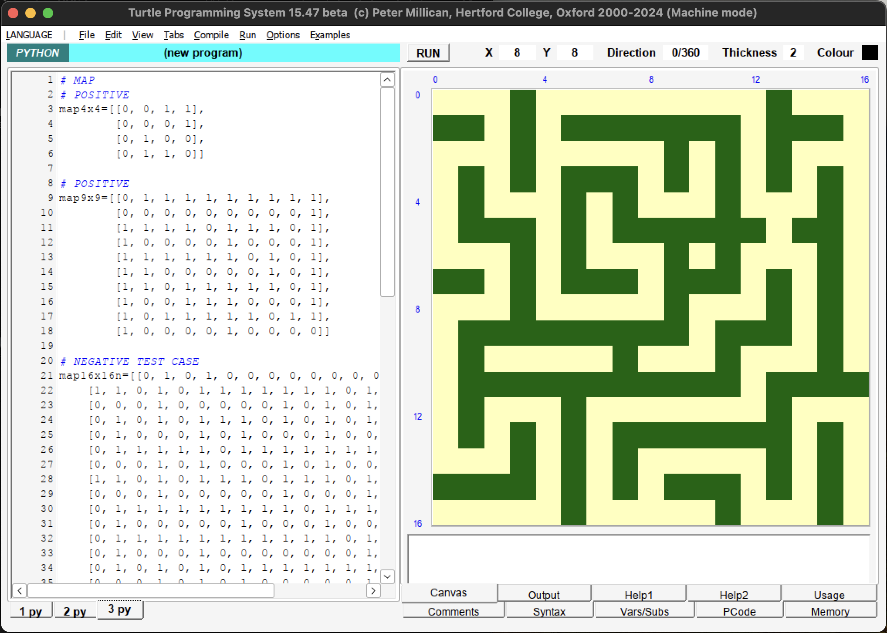
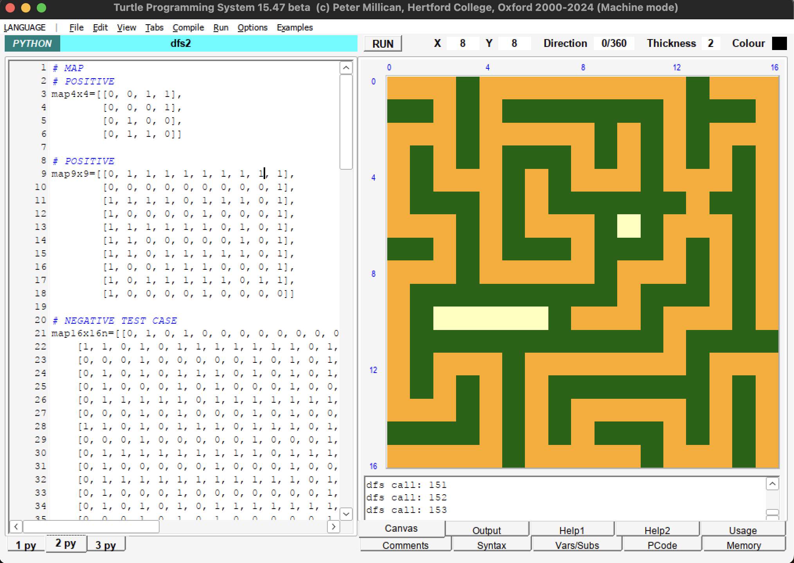

### Documentation for Maze Solver Using Depth-First Search (DFS)

#### Overview

  
  

This document provides a concise explanation of the Maze Solver program, which utilizes the Depth-First Search (DFS) algorithm to find a path through a given maze. The maze is represented as a 2D grid where open cells are marked by `0` (passable) and blocked cells are marked by `1` (impassable). The program is designed to visualize the path-finding process and can handle mazes of various sizes, demonstrating both the capability to find a path and handle situations where no path exists.

#### Program Startup and Map Initialization

Upon starting the program, a maze is chosen from predefined maps. These maps vary in size and complexity, as shown by the different examples provided in the code (e.g., `map4x4`, `map9x9`, `map16x16n`, and `map16x16`). The selected maze is then rendered using a simple graphical representation where:

- **Blocked cells** are displayed in dark green.
- **Free cells** are displayed in cream.
- **The path explored by DFS** is marked in orange.

The graphical canvas initializes based on the dimensions of the chosen maze, with each cell of the maze drawn according to its status (blocked or free).

> Unfortunately, my program only supports square matrices because I am unable to index into each row to get the number of colomns of the matrix.

#### Depth-First Search Algorithm

The DFS algorithm begins at the start position, at the top-left corner of the maze (0,0), and attempts to find a path to the destination, at the bottom-right corner. It explores paths recursively, moving to adjacent cells not visited yet and marking them as visited. The path exploration follows four potential directions: right, down, left, and up.

Key functions in the DFS implementation:

- `dfs(x, y, end_x, end_y, map)`: This recursive function attempts to find a path to the destination. It marks the current cell as visited and proceeds to explore adjacent cells. If the destination is reached, the function returns true, indicating a successful path has been found.
- `is_valid(x, y, map)`: Checks if the cell at position `(x, y)` is within bounds, not blocked, and not visited.
- `is_visited(x, y)`: Determines if the cell has been visited during the DFS exploration. We keep an array of visited coordinates.

#### Visualization and Path Drawing

As the DFS explores the maze, the path taken is visualized by changing the color of the cells involved in the current path to orange. If the end of the maze is reached, the path is traced back and visualized. If no path is found, the program outputs "No path found."

#### User Inputs and Settings

The user can select different maps by editing the `MAP` variable at the beginning of the code. This flexibility allows the testing of the maze solver in various scenarios. The `map_width` and `map_height` variables are automatically adjusted based on the chosen map, ensuring the graphics are scaled correctly for different maze sizes.

#### Special Features

- **Multiple Test Cases**: The code includes various predefined mazes to test the robustness and efficiency of the DFS algorithm in both simple and complex scenarios.
- **Visual Feedback**: Real-time visualization of the DFS algorithm provides insightful feedback on how the algorithm explores the maze, which is beneficial for educational and debugging purposes.
- **Error Handling**: The program checks for valid movements within the maze, preventing out-of-bound errors and ensuring that the path does not traverse blocked cells.

#### Conclusion

This Maze Solver program not only illustrates the practical application of the DFS algorithm in pathfinding but also serves as a tool for visualizing and understanding the dynamics of recursive algorithms in constrained environments. By adjusting the input mazes and observing the algorithm's behavior, users can gain deeper insights into the characteristics and performance of DFS in solving real-world problems.
