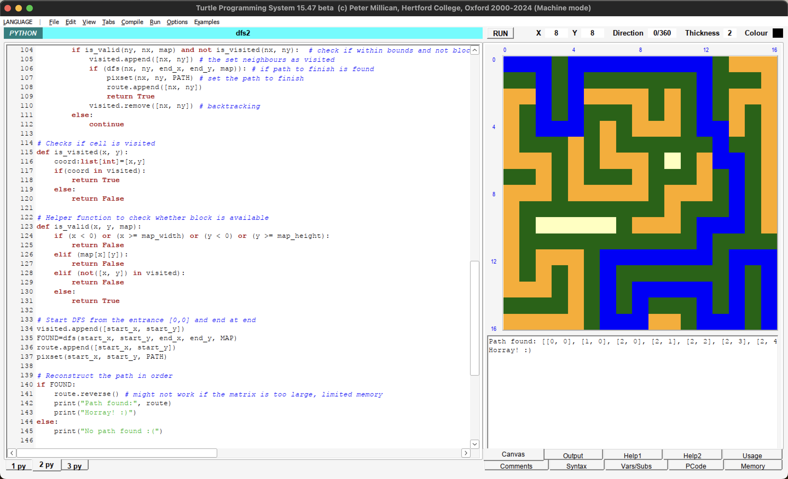
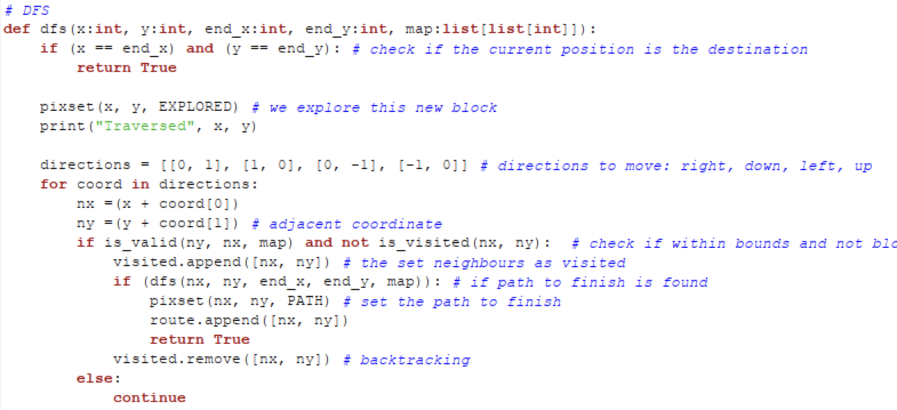

## Documentation for Maze Solver Using Depth-First Search (DFS)

### Overview

<p align="center">
  
  
</p>

This document provides a concise explanation of the Maze Solver program, which utilizes the Depth-First Search (DFS) algorithm to find a path through a given maze. The maze is represented as a 2D grid where open cells are marked by `0` (passable) and blocked cells are marked by `1` (impassable). The program is designed to visualize the path-finding process and can handle mazes of various sizes, demonstrating both the capability to find a path and handle situations where no path exists. You can visit

# ()[]

#### Program Startup and Map Initialization

Upon starting the program, you choose a maze from predefined maps. The maps differ in size and complexity, including examples like `map4x4`, `map9x9`, `map16x16n`, and `map16x16`. You can change the map by modifying the `MAP` variable in the code. The following color scheme is used to represent different states in the maze:

- **Blocked cells**: dark green.
- **Free cells**: cream.
- **Explored path**: orange.
- **Discovered path**: blue (indicates a valid route from start to finish).

The graphical canvas initializes based on the dimensions of the chosen maze, with each cell of the maze drawn according to its status (blocked or free).

> Unfortunately, my program only supports square matrices because I am unable to index into each row to get the number of colomns of the matrix.

### Depth-First Search Algorithm

The DFS algorithm begins at the start position, at the top-left corner of the maze (0,0), and attempts to find a path to the destination, at the bottom-right corner. It explores paths recursively, moving to adjacent cells not visited yet and marking them as visited. The path exploration follows four potential directions: right, down, left, and up.

Key functions in the DFS implementation:

- **`dfs(x, y, end_x, end_y, map)`**: This recursive function attempts to find a path to the destination. It marks the current cell as visited and proceeds to explore adjacent cells. If the destination is reached, the function returns true, indicating a successful path has been found.
- **`is_valid(x, y, map)`**: Checks if the cell at position `(x, y)` is within bounds, not blocked, and not visited.
- **`is_visited(x, y)`**: Determines if the cell has been visited during the DFS exploration. We keep an array of visited coordinates.

### Visualization and Path Drawing

As the DFS explores the maze, the path taken is visualized by changing the color of the cells involved in the current path to orange. If the end of the maze is reached, the path is traced back and visualized. If no path is found, the program outputs "No path found."

### User Inputs and Settings

The user can select different maps by editing the `MAP` variable at the beginning of the code. This flexibility allows the testing of the maze solver in various scenarios. The `map_width` and `map_height` variables are automatically adjusted based on the chosen map, ensuring the graphics are scaled correctly for different maze sizes.

### Special Features

- **Multiple Test Cases**: The code includes various predefined mazes to test the robustness and efficiency of the DFS algorithm in both simple and complex scenarios.
- **Backtracking**: If DFS reaches a dead-end, it backtracks to explore alternative paths.
- **Visual Feedback**: Real-time visualization of the DFS algorithm provides insightful feedback on how the algorithm explores the maze, which is beneficial for educational and debugging purposes.
- **Error Handling**: The program checks for valid movements within the maze, preventing out-of-bound errors and ensuring that the path does not traverse blocked cells.

### Conclusion

This Maze Solver program not only illustrates the practical application of the DFS algorithm in pathfinding but also serves as a tool for visualizing and understanding the dynamics of recursive algorithms in constrained environments. By adjusting the input mazes and observing the algorithm's behavior, users can gain deeper insights into the characteristics and performance of DFS in solving real-world problems.

## Appendix

> DFS Algorithm



The function `dfs` implements a Depth-First Search (DFS) algorithm to navigate through a grid-based map. The function is designed to determine if there is a path from a start position `(x, y)` to a destination `(end_x, end_y)` within the grid.

### Function Signature

```python
def dfs(x: int, y: int, end_x: int, end_y: int, map: list[list[int]])
```

### Detailed Function Description

#### Parameters

- `x (int)`: The current x-coordinate (row index) in the grid.
- `y (int)`: The current y-coordinate (column index) in the grid.
- `end_x (int)`: The x-coordinate (row index) of the destination.
- `end_y (int)`: The y-coordinate (column index) of the destination.
- `map (list[list[int]])`: A 2D matrix representing the grid where typically, 0 might indicate a passable area and 1 a blocked area.

#### Base Case

```python
if (x == end_x) and (y == end_y):
    return True
```

This condition checks if the current position matches the destination. If so, it confirms a successful path has been found and returns True.

#### Exploratory Mechanism

##### Marking Exploration:

```python
pixset(x, y, EXPLORED)
print("Traversed", x, y)
```

Marks the current cell as explored and outputs the traversal information, which aids in visual tracking and debugging.

##### Movement Directions:

```python
directions = [[0, 1], [1, 0], [0, -1], [-1, 0]]
```

Defines potential movements to adjacent cells, enabling exploration in four directions: right, down, left, and up.

##### Directional Exploration:

```python
for coord in directions:
    nx = (x + coord[0])
    ny = (y + coord[1])
```

Iterates over each direction to compute new positions `(nx, ny)` based on the current position.
Validation and Recursive Exploration

```python
if is_valid(ny, nx, map) and not is_visited(nx, ny):
    visited.append([nx, ny])
    if dfs(nx, ny, end_x, end_y, map):
        pixset(nx, ny, PATH)  # Marking the path visually
        route.append([nx, ny])  # Adding to the path list
        return True
    visited.remove([nx, ny])  # Backtracking if no path is found
```

Checks if the new position is within bounds, passable, and not previously visited. If valid, the position is marked as visited and a recursive call is made. If the recursive call returns True, it indicates a path to the destination is found; otherwise, it backtracks by removing the position from the visited list.

#### Backtracking

In cases where a path to the destination is not found through a particular recursive path, the algorithm backtracks, allowing exploration of alternative routes. This process continues until all possible paths are explored or a valid path is discovered.
